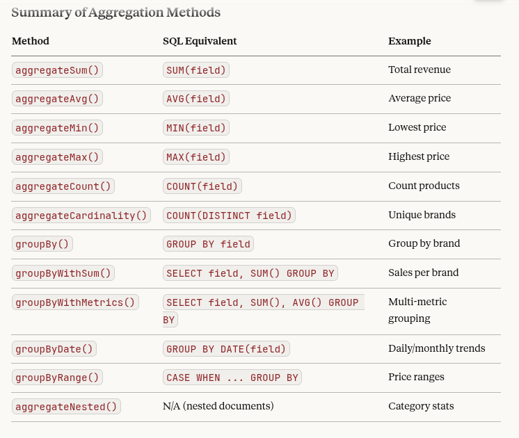

# Elasticsearch Eloquent

An elegant Eloquent-style query builder for Elasticsearch in Laravel. Write Elasticsearch queries using familiar Laravel syntax.

[](https://php.net)
[](https://laravel.com)
[](https://www.elastic.co)

## Features

✅ **Eloquent-style Query Builder** - Familiar Laravel syntax for Elasticsearch  
✅ **Comprehensive Where Clauses** - `where`, `whereIn`, `whereNull`, `whereNot`, `whereBetween`  
✅ **Nested Object Support** - Query nested objects with `whereNested()`  
✅ **Full-Text Search** - Powerful search with `search()` and `matchPhrase()`  
✅ **Aggregations** - `termsAgg()`, `sumAgg()`, `avgAgg()`, `minAgg()`, `maxAgg()`  
✅ **Sorting & Pagination** - `orderBy()`, `latest()`, `paginate()`  
✅ **Source Filtering** - Select specific fields with `select()`  
✅ **Type Casting** - Automatic type casting for attributes  
✅ **Model Scopes** - Define reusable query scopes

## Installation

Install via Composer:


```bash
composer require kiamars-mirzaee/elasticsearch-eloquent
```

### Publish Configuration

```bash
php artisan vendor:publish --tag=elasticsearch-config
```

### Environment Variables

Add to your `.env`:

```env
ELASTICSEARCH_HOST=localhost:9200
ELASTICSEARCH_USERNAME=
ELASTICSEARCH_PASSWORD=
```

## Quick Start Query conversion

Direct Conversion
```php

// MySQL/Eloquent version
->when(is_array($allowed_category_ids) && count($allowed_category_ids) > 0, function($q) use ($allowed_category_ids) {
    $q->whereHas('categories', fn($query) => $query->whereIn('categories.id', $allowed_category_ids));
})

// Elasticsearch version
->when(is_array($allowed_category_ids) && count($allowed_category_ids) > 0, function($q) use ($allowed_category_ids) {
    $q->whereNested('categories', fn($query) => $query->whereIn('id', $allowed_category_ids));
})

// Or using the cleaner whenHasAny helper
->whenHasAny($allowed_category_ids ?? [], function($q, $categoryIds) {
    $q->whereNested('categories', fn($query) => $query->whereIn('id', $categoryIds));
})
```

from direct usage
convert this to builder

```php
$elSearchQuery = [
    'index' => $index,
    'body' => [
        "size"=>$maxSuggestions,
        "_source"=>[$fieldName],
        "query"=>[
            "bool"=>[
                "should"=>[
                    [
                        "prefix" => [
                            "{$fieldName}.kw" => [
                                "value" => $searchTerm,
                                "boost" => 3,
                            ],
                        ],
                    ],
                    ["match_phrase_prefix" => [
                        "{$fieldName}.normalized" => [
                            "query" => $searchTerm,
                            "analyzer" => "persian_normalized_analyzer",
                            "boost" => 2,
                        ]
                    ],],
                    ["match_bool_prefix" => [
                        "{$fieldName}" => [
                            "query" => $searchTerm,
                            "boost" => 1,
                        ]
                    ],]
                ],
            ]
        ],
        "collapse"=>[
            "field"=>"{$fieldName}.kw",
        ]
    ],
];
// Or Using Fluent Methods (Cleaner):
$results = StoreProduct::search()
    ->select([$fieldName])
    ->wherePrefix("{$fieldName}.kw", $searchTerm, ['boost' => 3])
    ->matchPhrasePrefix("{$fieldName}.normalized", $searchTerm, [
        'analyzer' => 'persian_normalized_analyzer',
        'boost' => 2
    ])
    ->matchBoolPrefix($fieldName, $searchTerm, ['boost' => 1])
    ->collapse("{$fieldName}.kw")
    ->limit($maxSuggestions)
    ->get();
    
// Original raw query converted to builder pattern
$results = StoreProduct::search()
    ->select([$fieldName])
    ->shouldRaw([
        'prefix' => [
            "{$fieldName}.kw" => [
                'value' => $searchTerm,
                'boost' => 3,
            ]
        ]
    ])
    ->shouldRaw([
        'match_phrase_prefix' => [
            "{$fieldName}.normalized" => [
                'query' => $searchTerm,
                'analyzer' => 'persian_normalized_analyzer',
                'boost' => 2,
            ]
        ]
    ])
    ->shouldRaw([
        'match_bool_prefix' => [
            $fieldName => [
                'query' => $searchTerm,
                'boost' => 1,
            ]
        ]
    ])
    ->collapse("{$fieldName}.kw")
    ->limit($maxSuggestions)
    ->get();
```

#### Product Title Autocomplete

```php
use App\Services\Elasticsearch\AutocompleteBuilder;

// In your controller or service
public function autocompleteProductTitles(Request $request)
{
    $searchTerm = $request->input('q');
    
    $builder = new AutocompleteBuilder(
        app(\Elastic\Elasticsearch\Client::class),
        'products_index'
    );
    
    $results = $builder
        ->suggestions('title', $searchTerm, 10)
        ->get();
    
    return response()->json([
        'suggestions' => $results->pluck('title')
    ]);
}

```

### Multi-field Autocomplete 
```php
<?php

public function autocompleteProducts(Request $request)
{
    $searchTerm = $request->input('q');
    
    $results = StoreProduct::search()
        ->where('store_id', 1)
        ->where('can_purchase', true)
        // Search across multiple fields
        ->shouldRaw([
            'prefix' => [
                'title.kw' => [
                    'value' => $searchTerm,
                    'boost' => 5
                ]
            ]
        ])
        ->shouldRaw([
            'prefix' => [
                'brand.name.kw' => [
                    'value' => $searchTerm,
                    'boost' => 3
                ]
            ]
        ])
        ->shouldRaw([
            'match_phrase_prefix' => [
                'title.normalized' => [
                    'query' => $searchTerm,
                    'analyzer' => 'persian_normalized_analyzer',
                    'boost' => 2
                ]
            ]
        ])
        ->minimumShouldMatch(1)
        ->select(['id', 'title', 'slug', 'brand', 'price', 'img_src'])
        ->limit(10)
        ->get();
    
    return response()->json([
        'products' => $results
    ]);
}
```

## Category Suggestions
```php

<?php

public function autocompleteCategories(Request $request)
{
    $searchTerm = $request->input('q');
    
    $builder = new AutocompleteBuilder(
        app(\Elastic\Elasticsearch\Client::class),
        config('elasticsearch.index_prefix') . '_products'
    );
    
    $results = $builder
        ->whereNested('categories', function($q) use ($searchTerm) {
            $q->shouldRaw([
                'prefix' => [
                    'categories.title.kw' => [
                        'value' => $searchTerm,
                        'boost' => 3
                    ]
                ]
            ])
            ->shouldRaw([
                'match_phrase_prefix' => [
                    'categories.title' => [
                        'query' => $searchTerm,
                        'boost' => 2
                    ]
                ]
            ]);
        })
        ->collapse('categories.id')
        ->select(['categories'])
        ->limit(10)
        ->get();
    
    return response()->json([
        'categories' => $results->pluck('categories')->flatten(1)->unique('id')
    ]);
}
```

####  Brand Name Suggestions with Filters
```php
<?php

public function autocompleteBrands(Request $request)
{
    $searchTerm = $request->input('q');
    
    $results = StoreProduct::search()
        ->where('store_id', 1)
        ->where('state', 'published')
        ->autocomplete('brand.name', $searchTerm)
        ->collapse('brand.id.keyword')
        ->select(['brand.id', 'brand.name', 'brand.slug'])
        ->limit(10)
        ->get();
    
    return response()->json([
        'brands' => $results->map(fn($item) => [
            'id' => $item['brand']['id'],
            'name' => $item['brand']['name'],
            'slug' => $item['brand']['slug']
        ])
    ]);
}

```
### Advanced Suggestions with Highlighting
```php
<?php

public function advancedAutocomplete(Request $request)
{
    $searchTerm = $request->input('q');
    
    $results = StoreProduct::search()
        ->autocomplete('title', $searchTerm, [
            'boost' => [
                'prefix' => 5,
                'phrase' => 3,
                'bool' => 1
            ]
        ])
        ->where('can_purchase', true)
        ->whereGreaterThan('rating', 4.0)
        ->highlight(['title'], [
            'pre_tags' => ['<mark>'],
            'post_tags' => ['</mark>'],
            'fragment_size' => 150
        ])
        ->select(['id', 'title', 'slug', 'price', 'img_src', 'rating'])
        ->collapse('title.kw')
        ->orderByDesc('_score')
        ->orderByDesc('sale_count')
        ->limit(10)
        ->get();
    
    return response()->json([
        'suggestions' => $results->map(fn($item) => [
            'id' => $item['id'],
            'title' => $item['title'],
            'highlighted' => $item['_highlight']['title'][0] ?? $item['title'],
            'slug' => $item['slug'],
            'price' => $item['price'],
            'img_src' => $item['img_src'],
            'rating' => $item['rating'],
            'score' => $item['_score']
        ])
    ]);
}
```
## Use when condition
```php
<?php

use App\Models\StoreProduct;

// Simple condition
StoreProduct::search()
    ->when($request->has('category_id'), function ($query) use ($request) {
        $query->where('categories.id', $request->input('category_id'));
    })
    ->when($request->filled('min_price'), function ($query, $value) {
        $query->whereGreaterThanOrEqual('price', $value);
    })
    ->get();

// With else/default callback
StoreProduct::search()
    ->when(
        $request->filled('sort'),
        fn($q, $sort) => $q->orderBy('price', $sort === 'asc' ? 'asc' : 'desc'),
        fn($q) => $q->orderByDesc('created_at') // Default sorting
    )
    ->get();
```
advance when
```php
<?php

StoreProduct::search()
    ->setRequest($request)
    ->whenFilled('search', function ($query, $searchTerm) {
        $query->multiMatch(
            ['title', 'title.normalized', 'search_text'],
            $searchTerm,
            ['fuzziness' => 'AUTO']
        );
    })
    ->whenFilled('brand_id', fn($q, $brandId) => 
        $q->where('brand.id', $brandId)
    )
    ->whenFilled(['min_price', 'max_price'], function ($query) use ($request) {
        $query->whereBetween('price', [
            $request->input('min_price'),
            $request->input('max_price')
        ]);
    })
    ->whenBoolean('in_stock', fn($q) => 
        $q->where('out_of_stock', false)
          ->whereGreaterThan('stock', 0)
    )
    ->whenHasAny(['tags', 'collections'], function ($query) use ($request) {
        $query->orWhere(function ($q) use ($request) {
            if ($request->filled('tags')) {
                $q->whereNested('tags', fn($tq) => 
                    $tq->whereIn('id', $request->input('tags'))
                );
            }
            if ($request->filled('collections')) {
                $q->whereNested('collections', fn($cq) => 
                    $cq->whereIn('id', $request->input('collections'))
                );
            }
        });
    })
    ->paginate(20);
```

### Switch Statement Pattern 
```php
<?php

$sortBy = $request->input('sort', 'relevant');

StoreProduct::search()
    ->switch($sortBy, [
        'newest' => fn($q) => $q->orderByDesc('created_at'),
        'most_viewed' => fn($q) => $q->orderByDesc('num_review'),
        'best_selling' => fn($q) => $q->orderByDesc('sale_count'),
        'cheapest' => fn($q) => $q->orderBy('price', 'asc'),
        'most_expensive' => fn($q) => $q->orderByDesc('price'),
        'fastest_delivery' => fn($q) => $q->orderBy('preparation_time_in_day', 'asc'),
        'buyer_recommended' => fn($q) => $q->orderByDesc('rating'),
    ], fn($q) => $q->orderByDesc('_score')) // Default
    ->get();
```
# Nested Conditionals 
```php
<?php

StoreProduct::search()
    ->when($request->filled('filter_type'), function ($query) use ($request) {
        $filterType = $request->input('filter_type');
        
        $query->switch($filterType, [
            'new_arrivals' => fn($q) => 
                $q->whereGreaterThan('created_at', now()->subDays(30)->toDateString())
                  ->orderByDesc('created_at'),
                  
            'best_sellers' => fn($q) => 
                $q->whereGreaterThan('sale_count', 100)
                  ->orderByDesc('sale_count'),
                  
            'on_sale' => fn($q) => 
                $q->whereNotNull('sale_price')
                  ->when($request->filled('min_discount'), fn($subQ, $minDiscount) => 
                      $subQ->whereGreaterThanOrEqual('discount_percent', $minDiscount)
                  ),
                  
            'highly_rated' => fn($q) => 
                $q->whereGreaterThanOrEqual('rating', 4.5)
                  ->whereGreaterThan('total_rating', 50)
                  ->orderByDesc('rating'),
        ]);
    })
    ->get();
```
# Performance Optimization with Conditionals 
```php
<?php

StoreProduct::search()
    // Only load expensive aggregations if needed
    ->when($request->boolean('need_facets'), function ($query) {
        $query->aggregateTerms('popular_brands', 'brand.id', 50)
              ->aggregateTerms('categories', 'categories.id', 100)
              ->aggregate('price_ranges', [
                  'range' => [
                      'field' => 'price',
                      'ranges' => [
                          ['to' => 100000],
                          ['from' => 100000, 'to' => 500000],
                          ['from' => 500000, 'to' => 1000000],
                          ['from' => 1000000]
                      ]
                  ]
              ]);
    })
    
    // Limit source fields for list view vs detail view
    ->when($request->input('view') === 'list', 
        fn($q) => $q->select(['id', 'title', 'price', 'img_src', 'rating']),
        fn($q) => $q->select(['*'])
    )
    
    // Use scroll API for large result sets
    ->when($request->boolean('export'), function ($query) {
        $query->limit(1000);
    }, function ($query) {
        $query->limit(20);
    })
    
    ->get();
```

## relations

The Key Difference: Object vs Nested
```php
<?php

// Brand - Single Object (ONE brand per product)
->whereIn('brand.id', $allowed_brand_ids)

// Categories - Array of Nested Objects (MULTIPLE categories per product)
->whereNested('categories', fn($query) => $query->whereIn('id', $allowed_category_ids))
```

Why This Matters in Elasticsearch
Brand Query (Object)
```php
<?php

// ✅ CORRECT for single object
->whereIn('brand.id', [10, 20, 30])

// Elasticsearch query generated:
{
  "terms": {
    "brand.id": [10, 20, 30]
  }
}
```
This works because:

Each product has exactly ONE brand.id
Simple dot notation works: brand.id

Categories Query (Nested)
```php
<?php

// ❌ WRONG - This won't work correctly for nested arrays
->whereIn('categories.id', [5, 15, 25])

// ✅ CORRECT - Need nested query
->whereNested('categories', fn($query) => $query->whereIn('id', [5, 15, 25]))

// Elasticsearch query generated:
{
  "nested": {
    "path": "categories",
    "query": {
      "terms": {
        "id": [5, 15, 25]
      }
    }
  }
}
```

This is required because:

Each product has MULTIPLE categories (array)
Elasticsearch needs to know you're querying inside a nested array
The nested query creates the proper context

#### Schema Definition Comparison
Looking at your Elasticsearch mapping:

```php
<?php

// From StoreProduct2Searchable::createIndexSchema()

'brand' => [
    'type' => 'object',  // ← Single object
    'properties' => [
        "id" => ['type' => 'keyword'],
        "name" => [...],
        "slug" => [...]
    ]
],

'categories' => [
    'type' => 'nested',  // ← Array of nested objects
    'properties' => [
        "id" => ['type' => 'keyword'],
        "title" => [...],
        "slug" => [...],
        "ancestor_ids" => [...],
        "grandchildren" => [...]
    ]
]
```


```php

// ✅ GOOD: Single nested query with multiple conditions
->whenHasAny($allowed_category_ids ?? [], function($query, $categoryIds) {
    $query->whereNested('categories', function($q) use ($categoryIds, $request) {
        $q->whereIn('id', $categoryIds);
        
        // Add more conditions within the same nested query
        if ($request->filled('category_status')) {
            $q->where('status', $request->input('category_status'));
        }
    });
})

// ❌ AVOID: Multiple separate nested queries (less efficient)
->whenHasAny($allowed_category_ids ?? [], function($query, $categoryIds) {
    $query->whereNested('categories', fn($q) => $q->whereIn('id', $categoryIds));
})
->when($request->filled('category_status'), function($query) use ($request) {
    $query->whereNested('categories', fn($q) => $q->where('status', $request->input('category_status')));
})
```

```php
<?php

// Find products in specific categories with specific tags
StoreProduct::search()
    ->whereNested('categories', function($q) {
        $q->whereIn('id', [5, 15, 25])
          ->where('status', 'active');
    })
    ->whereNested('tags', function($q) {
        $q->whereIn('id', [100, 200])
          ->where('type', 'feature');
    })
    ->get();

// This maintains the relationship within each nested object
```

## Visual Representation

### Brand (Object) - One-to-One
```
Product → Brand
   |        |
   |        ├─ id: 10
   |        ├─ name: "Apple"
   |        └─ slug: "apple"
   |
   └─ Query: brand.id = 10 ✅ Simple!
```

### Categories (Nested) - One-to-Many
```
Product → Categories []
   |        |
   |        ├─ [0]
   |        |   ├─ id: 5
   |        |   ├─ title: "Electronics"
   |        |   └─ slug: "electronics"
   |        |
   |        ├─ [1]
   |        |   ├─ id: 15
   |        |   ├─ title: "Mobile"
   |        |   └─ slug: "mobile"
   |        |
   |        └─ [2]
   |            ├─ id: 25
   |            ├─ title: "Smartphones"
   |            └─ slug: "smartphones"
   |
   └─ Query: Need nested context to search in array ⚠️
```

# Debug query
```php


$query = StoreProduct::search()
    ->whenHasAny($allowed_category_ids ?? [], function($q, $categoryIds) {
        $q->whereNested('categories', fn($query) => $query->whereIn('id', $categoryIds));
    });

// See the raw Elasticsearch query
dd($query->toArray());

// Or as JSON
logger($query->toJson());


/*
 * This will output something like:
 {
  "query": {
    "bool": {
      "filter": [
        {
          "nested": {
            "path": "categories",
            "query": {
              "bool": {
                "filter": [
                  {
                    "terms": {
                      "id": [1, 2, 3, 10, 15]
                    }
                  }
                ]
              }
            }
          }
        }
      ]
    }
  }
}*/
```
# search 

###
Basic Usage - Single Field

```php

use App\Models\StoreProduct;

// Simple search on title field
$results = StoreProduct::search()
    ->where('store_id', 1)
    ->where('state', 'published')
    ->defaultSearch($request->input('q'), 'title')
    ->orderByDesc('_score')
    ->paginate(20);
```
### Search with Custom Boosts
```php
$results = StoreProduct::search()
    ->where('store_id', 1)
    ->defaultSearch($request->input('q'), 'title', [
        'prefix_kw' => 15,              // Increase exact prefix match importance
        'phrase_prefix_normalized' => 10,
        'phrase_normalized' => 8,
        'phrase_prefix_main' => 6,
        'phrase_main' => 4,
        'match_and_main' => 2,
        'match_and_normalized' => 1,
    ])
    ->orderByDesc('_score')
    ->orderByDesc('sale_count')
    ->paginate(20);
```
###  Multi-Field Search
```php
<?php

// Search across multiple fields
$results = StoreProduct::search()
    ->where('store_id', 1)
    ->where('state', 'published')
    ->defaultMultiSearch($request->input('q'), [
        'title',
        'brand.name',
        'search_text'
    ])
    ->orderByDesc('_score')
    ->paginate(20);
```

### search with filter
```php
<?php

$searchTerm = $request->input('q');

$results = StoreProduct::search()
    ->where('store_id', 1)
    ->where('state', 'published')
    ->where('can_purchase', true)
    
    // Apply the sophisticated search
    ->when($searchTerm, fn($q) => $q->defaultSearch($searchTerm, 'title'))
    
    // Additional filters
    ->whenFilled('brand_id', fn($q, $brandId) => 
        $q->whereIn('brand.id', (array) $brandId)
    )
    ->whenFilled('category_id', fn($q, $categoryId) => 
        $q->whereNested('categories', fn($cq) => 
            $cq->whereIn('id', (array) $categoryId)
        )
    )
    ->whenFilled('min_price', fn($q, $minPrice) => 
        $q->whereGreaterThanOrEqual('price', $minPrice)
    )
    
    // Sort by relevance first, then by popularity
    ->orderByDesc('_score')
    ->orderByDesc('sale_count')
    ->paginate(20);

```

```php
$results = ElasticsearchQueryBuilder::new($client, 'products')
    ->fuzzyMatch('name', 'iphnoe')
    ->get();
```

### 🔥 Hybrid Search + Completion (Amazon Style)

Now you get:

Relevant results

Autocomplete suggestions

Same API call 🔥

```php

$response = ElasticsearchQueryBuilder::new($client, 'products')
    ->hybridSearch(
        'iph',
        ['name^3', 'description'],
        'name_suggest'
    );


```

### 1. Create Your Model

```php
<?php

namespace App\Models;

use ElasticsearchEloquent\Model;

class Product extends Model
{
    protected string $index = 'products';
    
    protected array $casts = [
        'price' => 'float',
        'in_stock' => 'boolean',
        'cat_id' => 'array',
    ];
}
```

### 2. Query Your Data

```php
// Simple where clause
$products = Product::where('in_stock', true)->get();

// Multiple conditions
$products = Product::where('price', '>', 100)
    ->where('price', '<', 500)
    ->orderBy('price', 'asc')
    ->get();

// Full-text search
$products = Product::search('laptop', ['name', 'description'])
    ->where('in_stock', true)
    ->paginate(20);
```

---

## 🚨 Scout Pitfalls in Production (And How This Package Solves Them)

If you've used **Laravel Scout** in production, you've likely encountered these challenges. Here's what breaks at scale—and how **Elasticsearch Eloquent** handles it differently.

### ❌ Pitfall 1: Dynamic Mapping Surprises

**The Problem:**
Scout relies on Elasticsearch's dynamic mapping. Elasticsearch guesses field types based on the first document it sees:
- A timestamp might become a `text` field instead of `date`
- A float might become `long`, breaking range queries
- Changing a field type later requires full reindexing

**Real Production Scenario:**
```php
// First product has price "99.99" → mapped as text
Product::create(['name' => 'Book', 'price' => '99.99']);

// Later, range query fails silently or returns wrong results
Product::search()->where('price', '>', 100)->get(); // ❌ Broken
```

**How Elasticsearch Eloquent Solves This:**
```php
class Product extends Model
{
    protected array $mapping = [
        'properties' => [
            'price' => ['type' => 'float'],
            'created_at' => ['type' => 'date'],
            'in_stock' => ['type' => 'boolean'],
        ]
    ];
}

// Explicit mappings = predictable behavior
Product::where('price', '>', 100)->get(); // ✅ Works correctly
```

**Why This Matters:**
- Mappings are **source of truth** in your codebase
- No silent failures in production
- Schema evolution is intentional, not accidental

---

### ❌ Pitfall 2: Nested Object Chaos

**The Problem:**
Scout doesn't understand nested objects. Denormalized data (common in Elasticsearch) becomes impossible to query correctly.

**Real Production Scenario:**
```json
// Your Elasticsearch document
{
  "name": "Laptop",
  "categories": [
    {"id": 1, "name": "Electronics"},
    {"id": 5, "name": "Computers"}
  ]
}
```

```php
// Scout can't do this properly
// You end up writing raw Elasticsearch queries in controllers
$client->search([
    'index' => 'products',
    'body' => [
        'query' => [
            'nested' => [
                'path' => 'categories',
                'query' => ['term' => ['categories.id' => 5]]
            ]
        ]
    ]
]);
```

**How Elasticsearch Eloquent Solves This:**
```php
// Clean, readable, testable
Product::whereNested('categories', function ($query) {
    $query->where('categories.id', 5);
})->get();

// Multiple nested conditions
Product::whereNested('categories', function ($query) {
    $query->where('categories.name', 'Electronics')
          ->where('categories.featured', true);
})->get();
```

**Why This Matters:**
- No raw arrays in controllers
- Testable query logic
- Reusable via model scopes

---

### ❌ Pitfall 3: No Aggregation Support

**The Problem:**
Scout is built for search, not analytics. Want to know the average price? Top-selling categories? You're back to raw Elasticsearch queries.

**Real Production Scenario:**
```php
// Scout forces you to drop down to raw queries
$client = app(\Elastic\Elasticsearch\Client::class);
$results = $client->search([
    'index' => 'products',
    'body' => [
        'size' => 0,
        'aggs' => [
            'avg_price' => ['avg' => ['field' => 'price']],
            'categories' => ['terms' => ['field' => 'category_id']]
        ]
    ]
]);
```

**How Elasticsearch Eloquent Solves This:**
```php
$query = Product::where('in_stock', true)
    ->avgAgg('average_price', 'price')
    ->termsAgg('top_categories', 'category_id', 10)
    ->sumAgg('total_inventory_value', 'price');

$products = $query->get();
$stats = $query->getAggregations();

echo $stats['average_price']['value'];
// ["buckets" => [["key" => 1, "doc_count" => 150], ...]]
```

**Why This Matters:**
- Analytics in the same query as results
- No context switching between search and stats
- Stays inside Laravel's mental model

---

### ❌ Pitfall 4: Broken Bulk Updates

**The Problem:**
Scout syncs via model events (`saved`, `deleted`). Bulk updates bypass these events entirely.

**Real Production Scenario:**
```php
// This updates MySQL but NOT Elasticsearch
Product::where('category_id', 5)->update(['featured' => true]);

// Your search results are now stale
Product::search('laptop')->where('featured', true)->get(); // ❌ Missing data
```

**Scout's "Solution":** Manually re-sync thousands of records:
```php
Product::where('category_id', 5)->searchable(); // Slow, blocks requests
```

**How Elasticsearch Eloquent Solves This:**
```php
// Option 1: Trait-based auto-sync (via queues)
use ElasticsearchEloquent\Concerns\Searchable;

class Product extends EloquentModel
{
    use Searchable;
    
    protected static $searchableAs = \App\SearchModels\Product::class;
}

// Option 2: Explicit bulk sync job
Product::where('category_id', 5)
    ->chunk(1000, function ($products) {
        BulkSyncToElasticsearch::dispatch($products);
    });
```

**Why This Matters:**
- Queues prevent blocking user requests
- Explicit control over sync strategy
- Designed for high-throughput systems

---

### ❌ Pitfall 5: No Zero-Downtime Reindexing

**The Problem:**
Scout writes directly to `products` index. To change mappings (e.g., text → keyword), you must:
1. Drop the index → Downtime ❌
2. Recreate with new mappings
3. Re-sync all data → More downtime ❌

**Real Production Scenario:**
```bash
# Your app breaks during this process
curl -X DELETE localhost:9200/products
curl -X PUT localhost:9200/products -d '{"mappings": {...}}'
php artisan scout:import "App\Models\Product" # 30+ minutes
```

**How Elasticsearch Eloquent Solves This:**
```php
// Use aliases (industry standard pattern)
// 1. Create new index
Product::createIndex('products_v2', $newMapping);

// 2. Reindex data (background job)
ReindexJob::dispatch('products_v1', 'products_v2');

// 3. Atomic alias swap (zero downtime)
Product::swapAlias('products', 'products_v1', 'products_v2');

// 4. Delete old index
Product::deleteIndex('products_v1');
```

**Why This Matters:**
- No downtime during schema changes
- Production-safe deployments
- Rollback safety (keep old index until verified)

---

### ❌ Pitfall 6: Limited Query Expressiveness

**The Problem:**
Scout's query builder is intentionally simple. Complex scoring, boosting, or multi-field queries require dropping into raw Elasticsearch DSL.

**Real Production Scenario:**
```php
// Scout can't express this cleanly
$client->search([
    'index' => 'products',
    'body' => [
        'query' => [
            'bool' => [
                'should' => [
                    ['match' => ['name' => ['query' => 'laptop', 'boost' => 3]]],
                    ['match' => ['description' => 'laptop']],
                ],
                'filter' => [
                    ['term' => ['in_stock' => true]],
                    ['range' => ['price' => ['lte' => 2000]]]
                ]
            ]
        ]
    ]
]);
```

**How Elasticsearch Eloquent Solves This:**
```php
// Option 1: Expressive API
Product::search('laptop', ['name^3', 'description'])
    ->where('in_stock', true)
    ->where('price', '<=', 2000)
    ->get();

// Option 2: Model scopes for reusability
Product::smartSearch('title', 'laptop')
    ->inStock()
    ->get();

// Option 3: Raw DSL when needed (escape hatch)
Product::whereRaw([
    'bool' => [
        'should' => [
            ['prefix' => ['name.keyword' => ['value' => 'lap', 'boost' => 10]]],
            ['match_phrase_prefix' => ['name' => 'laptop']],
        ]
    ]
])->get();
```

**Why This Matters:**
- Start simple, grow into complexity
- Escape hatch without leaving the query builder
- Reusable logic via scopes

---

### ❌ Pitfall 7: Analyzer and Tokenization Blindness

**The Problem:**
Scout doesn't expose Elasticsearch's analyzer system. Multi-language search, autocomplete, or stemming requires manual index configuration outside Laravel.

**Real Production Scenario:**
```php
// Persian/Arabic users search for "لپ‌تاپ"
// Scout's default analyzer fails because it doesn't handle:
// - Right-to-left text
// - Diacritics normalization
// - Language-specific stemming
```

**How Elasticsearch Eloquent Solves This:**
```php
class Product extends Model
{
    protected array $settings = [
        'analysis' => [
            'analyzer' => [
                'persian_normalized' => [
                    'type' => 'custom',
                    'tokenizer' => 'standard',
                    'filter' => ['lowercase', 'arabic_normalization', 'persian_normalization']
                ]
            ]
        ]
    ];
    
    protected array $mapping = [
        'properties' => [
            'title' => [
                'type' => 'text',
                'fields' => [
                    'normalized' => ['type' => 'text', 'analyzer' => 'persian_normalized'],
                    'keyword' => ['type' => 'keyword']
                ]
            ]
        ]
    ];
}

// Now search works correctly for Persian users
Product::smartSearch('title', 'لپ‌تاپ')->get();
```

**Why This Matters:**
- Analyzers are code, not external config
- Multi-language apps are first-class
- Autocomplete, stemming, n-grams are accessible

---

## 📋 TL;DR: Scout → Elasticsearch Eloquent Migration Checklist

### When to Migrate

Migrate from Scout if you're experiencing:

- [ ] Incorrect search results due to dynamic mapping issues
- [ ] Need for nested object queries (denormalized data)
- [ ] Requirement for aggregations/analytics alongside search
- [ ] Bulk update sync failures
- [ ] Downtime during mapping changes
- [ ] Multi-language search challenges
- [ ] Complex scoring/boosting needs

### Migration Steps

#### 1. **Install Package**
```bash
composer require kiamars-mirzaee/elasticsearch-eloquent
php artisan vendor:publish --tag=elasticsearch-config
```

#### 2. **Create Search Models** (Separate from Eloquent Models)
```php
// app/SearchModels/Product.php
namespace App\SearchModels;

use ElasticsearchEloquent\Model;

class Product extends Model
{
    protected string $index = 'products';
    
    // ✅ Explicit mappings (no dynamic mapping surprises)
    protected array $mapping = [
        'properties' => [
            'id' => ['type' => 'keyword'],
            'name' => ['type' => 'text'],
            'price' => ['type' => 'float'],
            'in_stock' => ['type' => 'boolean'],
            'created_at' => ['type' => 'date'],
        ]
    ];
    
    // ✅ Custom analyzers for your use case
    protected array $settings = [
        'number_of_shards' => 2,
        'number_of_replicas' => 1,
    ];
    
    protected array $casts = [
        'price' => 'float',
        'in_stock' => 'boolean',
    ];
}
```

#### 3. **Add Searchable Trait to Eloquent Models** (Optional Auto-Sync)
```php
// app/Models/Product.php (your database model)
namespace App\Models;

use Illuminate\Database\Eloquent\Model;
use ElasticsearchEloquent\Concerns\Searchable;

class Product extends Model
{
    use Searchable;
    
    // Link to your search model
    protected static $searchableAs = \App\SearchModels\Product::class;
    
    // Optional: customize what data gets indexed
    public function toSearchableArray(): array
    {
        return [
            'id' => $this->id,
            'name' => $this->name,
            'price' => $this->price,
            'in_stock' => $this->in_stock,
            'created_at' => $this->created_at?->toIso8601String(),
        ];
    }
}
```

#### 4. **Create Index with Mappings**
```bash
php artisan tinker
```
```php
\App\SearchModels\Product::createIndex();
```

#### 5. **Initial Data Migration**
```php
// Option 1: Bulk sync via chunk (recommended)
\App\Models\Product::chunk(1000, function ($products) {
    \App\Jobs\BulkSyncToElasticsearch::dispatch($products);
});

// Option 2: One-time manual sync
\App\Models\Product::all()->each(function ($product) {
    $product->searchable(); // If using Searchable trait
});
```

#### 6. **Update Queries in Controllers**

**Before (Scout):**
```php
// Limited expressiveness
$products = Product::search($request->query)
    ->where('in_stock', 1)
    ->paginate();
```

**After (Elasticsearch Eloquent):**
```php
// Full power of Elasticsearch
$products = \App\SearchModels\Product::search($request->query, ['name', 'description'])
    ->where('in_stock', true)
    ->whereBetween('price', [$minPrice, $maxPrice])
    ->whereNested('categories', function ($q) use ($categoryId) {
        $q->where('categories.id', $categoryId);
    })
    ->termsAgg('top_brands', 'brand.name', 10)
    ->orderBy('_score', 'desc')
    ->paginate(20);
```

#### 7. **Verify Sync is Working**
```php
// Create a product
$product = Product::create([...]);

// Check it appears in Elasticsearch (within queue delay)
sleep(2); // Wait for queue to process
$found = \App\SearchModels\Product::where('id', $product->id)->first();
dd($found); // Should show your product
```

#### 8. **Remove Scout (Optional)**
```bash
composer remove laravel/scout
```

Remove Scout config and service provider references.

---

### Common Migration Patterns

#### Pattern 1: Keep Both (Gradual Migration)

```php
// Keep Scout for simple searches
use Laravel\Scout\Searchable as ScoutSearchable;

// Use Elasticsearch Eloquent for complex searches
use ElasticsearchEloquent\Concerns\Searchable as ElasticSearchable;

class Product extends Model
{
    use ScoutSearchable, ElasticSearchable;
    
    protected static $searchableAs = \App\SearchModels\Product::class;
}
```

#### Pattern 2: Separate Search Logic

```php
// app/Services/ProductSearchService.php
class ProductSearchService
{
    public function search(array $filters)
    {
        $query = SearchProduct::query();
        
        if ($filters['query'] ?? null) {
            $query->search($filters['query'], ['name', 'description']);
        }
        
        if ($filters['price_min'] ?? null) {
            $query->where('price', '>=', $filters['price_min']);
        }
        
        return $query->paginate(20);
    }
}
```

#### Pattern 3: Model Scopes for Reusability

```php
// app/SearchModels/Product.php
public function scopeInStock($query)
{
    return $query->where('in_stock', true);
}

public function scopePriceRange($query, $min, $max)
{
    return $query->whereBetween('price', [$min, $max]);
}

// Usage
Product::inStock()->priceRange(100, 500)->get();
```

---

### Performance Checklist

After migration:

- [ ] Verify mappings are correct (`GET /products/_mapping`)
- [ ] Test query performance (`/_search?explain=true`)
- [ ] Monitor slow queries (Elasticsearch slow log)
- [ ] Set up index aliases for zero-downtime updates
- [ ] Configure replica count based on read load
- [ ] Add monitoring (Kibana or similar)
- [ ] Test sync under load (queue monitoring)

---

## Documentation

### Basic Where Clauses

```php
// Equal
Product::where('name', 'Laptop')->get();
Product::where('price', 999.99)->get();

// Operators
Product::where('price', '>', 500)->get();
Product::where('price', '<=', 1000)->get();

// Multiple conditions (AND)
Product::where('in_stock', true)
    ->where('price', '>', 100)
    ->get();

// Array of conditions
Product::where([
    'in_stock' => true,
    'featured' => true,
])->get();

// OR conditions
Product::where('category', 'Electronics')
    ->orWhere('category', 'Computers')
    ->get();
```

### Where In / Not In

```php
// Where in
Product::whereIn('cat_id', [1, 5, 12])->get();

// Where not in
Product::whereNotIn('cat_id', [99, 100])->get();

// Or where in
Product::where('in_stock', true)
    ->orWhereIn('category_id', [1, 2, 3])
    ->get();
```

### Where Null / Not Null

```php
// Where null
Product::whereNull('description')->get();

// Where not null
Product::whereNotNull('description')->get();

// Or where null
Product::where('price', 0)
    ->orWhereNull('price')
    ->get();
```

### Where Not

```php
// Where not equal
Product::whereNot('status', 'archived')->get();

// Where not with operator
Product::whereNot('price', '>', 5000)->get();

// Multiple where not
Product::whereNot([
    'archived' => true,
    'deleted' => true,
])->get();
```

### Where Between

```php
// Between
Product::whereBetween('price', [100, 500])->get();

// Not between
Product::whereNotBetween('price', [0, 10])->get();

// Date range
Product::whereBetween('created_at', [
    '2024-01-01',
    '2024-12-31',
])->get();
```

### Nested Object Queries

Perfect for denormalized data structures:

```php
// Your Elasticsearch document structure:
{
  "name": "Laptop Pro",
  "brand": {
    "id": 10,
    "name": "TechBrand",
    "country": "USA"
  },
  "categories": [
    {"id": 1, "name": "Electronics"},
    {"id": 5, "name": "Computers"}
  ],
  "tags": [
    {"id": 20, "name": "laptop"},
    {"id": 21, "name": "professional"}
  ]
}

// Query nested brand
Product::whereNested('brand', function ($query) {
    $query->where('brand.name', 'TechBrand')
          ->where('brand.country', 'USA');
})->get();

// Query nested categories array
Product::whereNested('categories', function ($query) {
    $query->where('categories.name', 'Electronics');
})->get();

// Query nested tags
Product::whereNested('tags', function ($query) {
    $query->whereIn('tags.name', ['laptop', 'gaming']);
})->get();
```

### Full-Text Search

```php
// Search across all fields
Product::search('gaming laptop')->get();

// Search specific fields
Product::search('laptop', ['name', 'description'])->get();

// Search with filters
Product::search('laptop', ['name', 'description'])
    ->where('price', '<', 2000)
    ->where('in_stock', true)
    ->paginate(20);

// Match phrase (exact phrase)
Product::matchPhrase('description', 'high performance')->get();

// Minimum score threshold
Product::search('laptop')
    ->minScore(1.5)
    ->get();
```

### Sorting

```php
// Order by
Product::orderBy('price', 'asc')->get();
Product::orderBy('created_at', 'desc')->get();

// Order by descending
Product::orderByDesc('price')->get();

// Multiple sorts
Product::orderBy('in_stock', 'desc')
    ->orderBy('price', 'asc')
    ->get();

// Latest/Oldest helpers
Product::latest('created_at')->get();
Product::oldest('created_at')->get();
```

### Limiting & Pagination

```php
// Take/Limit
Product::take(10)->get();
Product::limit(10)->get();

// Skip/Offset
Product::skip(20)->take(10)->get();
Product::offset(20)->limit(10)->get();

// First result
$product = Product::where('name', 'Laptop')->first();

// Pagination
$products = Product::where('in_stock', true)
    ->orderBy('price', 'desc')
    ->paginate(15);

// Custom page
$products = Product::paginate(20, ['*'], 'page', 2);
```

### Selecting Fields

```php
// Select specific fields (source filtering)
Product::select(['name', 'price', 'brand'])->get();

// Get with columns
Product::where('in_stock', true)->get(['name', 'price']);
```

### Aggregations

```php
// Terms aggregation (category distribution)
$aggs = Product::query()
    ->termsAgg('categories', 'cat_id', 20)
    ->getAggregations();

// Sum aggregation
$aggs = Product::query()
    ->sumAgg('total_value', 'price')
    ->getAggregations();

// Average
$aggs = Product::query()
    ->avgAgg('average_price', 'price')
    ->getAggregations();

// Min & Max
$aggs = Product::query()
    ->minAgg('min_price', 'price')
    ->maxAgg('max_price', 'price')
    ->getAggregations();

// Multiple aggregations
$aggs = Product::query()
    ->where('in_stock', true)
    ->termsAgg('top_brands', 'brand.name', 10)
    ->avgAgg('avg_price', 'price')
    ->sumAgg('total_value', 'price')
    ->getAggregations();
```

### Count

```php
// Count all
$count = Product::count();

// Count with conditions
$count = Product::where('in_stock', true)->count();
$count = Product::whereIn('cat_id', [1, 2, 3])->count();
```

### Model Scopes

Define reusable query logic:

```php
class Product extends Model
{
    public function scopeInStock($query)
    {
        return $query->where('in_stock', true);
    }
    
    public function scopeByBrand($query, string $brandName)
    {
        return $query->whereNested('brand', function ($q) use ($brandName) {
            $q->where('brand.name', $brandName);
        });
    }
    
    public function scopeInCategory($query, int $categoryId)
    {
        return $query->whereIn('cat_id', [$categoryId]);
    }
}

// Use scopes
Product::inStock()->get();
Product::byBrand('TechBrand')->get();
Product::inCategory(5)->get();

// Chain scopes
Product::inStock()
    ->byBrand('TechBrand')
    ->orderBy('price', 'asc')
    ->get();
```


## Aggregation Methods

#### Simple Sum
```php
<?php

use App\Models\StoreProduct;

// Calculate total sales amount
$result = StoreProduct::search()
    ->where('store_id', 1)
    ->where('state', 'published')
    ->aggregateSum('total_revenue', 'price')
    ->aggregateSum('total_sales_count', 'sale_count')
    ->limit(0) // We only want aggregations, not documents
    ->get();

$aggregations = $result->getAggregations();

echo "Total Revenue: " . $aggregations['total_revenue']['value'];
echo "Total Sales: " . $aggregations['total_sales_count']['value'];
```

#### Group By (Like SQL GROUP BY)
```php
<?php

// Sales by brand (like: SELECT brand_id, COUNT(*), SUM(sale_count) FROM products GROUP BY brand_id)
$result = StoreProduct::search()
    ->where('store_id', 1)
    ->where('state', 'published')
    ->groupByWithMetrics('sales_by_brand', 'brand.id', [
        'total_products' => 'value_count:id',
        'total_sales' => 'sum:sale_count',
        'avg_price' => 'avg:price',
        'total_revenue' => 'sum:price',
    ], 50) // Top 50 brands
    ->limit(0)
    ->get();

$aggregations = $result->getAggregations();

foreach ($aggregations['sales_by_brand']['buckets'] as $bucket) {
    echo "Brand ID: {$bucket['key']}\n";
    echo "Products: {$bucket['total_products']['value']}\n";
    echo "Total Sales: {$bucket['total_sales']['value']}\n";
    echo "Average Price: {$bucket['avg_price']['value']}\n";
    echo "Revenue: {$bucket['total_revenue']['value']}\n";
    echo "---\n";
}
```
### Multiple Group Bys
```php
<?php

// Sales by brand and category
$result = StoreProduct::search()
    ->where('store_id', 1)
    ->groupBy('by_brand', 'brand.id', 20, [
        // For each brand, group by main category
        'by_category' => [
            'terms' => [
                'field' => 'main_category_id',
                'size' => 10
            ],
            'aggs' => [
                'total_sales' => ['sum' => ['field' => 'sale_count']],
                'total_revenue' => ['sum' => ['field' => 'price']],
                'avg_rating' => ['avg' => ['field' => 'rating']],
            ]
        ]
    ])
    ->limit(0)
    ->get();

$aggregations = $result->getAggregations();

foreach ($aggregations['by_brand']['buckets'] as $brandBucket) {
    echo "Brand ID: {$brandBucket['key']}\n";
    
    foreach ($brandBucket['by_category']['buckets'] as $categoryBucket) {
        echo "  Category ID: {$categoryBucket['key']}\n";
        echo "    Sales: {$categoryBucket['total_sales']['value']}\n";
        echo "    Revenue: {$categoryBucket['total_revenue']['value']}\n";
        echo "    Avg Rating: {$categoryBucket['avg_rating']['value']}\n";
    }
    echo "\n";
}
```
### Date Histogram (Sales Over Time)
```php


// Sales per day for the last 30 days
$result = StoreProduct::search()
    ->where('store_id', 1)
    ->whereGreaterThan('created_at', now()->subDays(30)->toDateString())
    ->groupByDate('sales_by_day', 'created_at', 'day', [
        'product_count' => ['value_count' => ['field' => 'id']],
        'total_sales' => ['sum' => ['field' => 'sale_count']],
        'total_revenue' => ['sum' => ['field' => 'price']],
    ])
    ->limit(0)
    ->get();

$aggregations = $result->getAggregations();

foreach ($aggregations['sales_by_day']['buckets'] as $bucket) {
    echo "Date: {$bucket['key_as_string']}\n";
    echo "Products Listed: {$bucket['product_count']['value']}\n";
    echo "Sales: {$bucket['total_sales']['value']}\n";
    echo "Revenue: {$bucket['total_revenue']['value']}\n";
    echo "---\n";
}
```
### Range Aggregation (Price Ranges)
```php
<?php

// Products grouped by price ranges
$result = StoreProduct::search()
    ->where('store_id', 1)
    ->where('state', 'published')
    ->groupByRange('products_by_price', 'price', [
        ['key' => 'budget', 'to' => 100000],
        ['key' => 'mid_range', 'from' => 100000, 'to' => 500000],
        ['key' => 'premium', 'from' => 500000, 'to' => 1000000],
        ['key' => 'luxury', 'from' => 1000000],
    ], [
        'avg_rating' => ['avg' => ['field' => 'rating']],
        'total_sales' => ['sum' => ['field' => 'sale_count']],
    ])
    ->limit(0)
    ->get();

$aggregations = $result->getAggregations();

foreach ($aggregations['products_by_price']['buckets'] as $bucket) {
    echo "Range: {$bucket['key']}\n";
    echo "Count: {$bucket['doc_count']}\n";
    echo "Avg Rating: {$bucket['avg_rating']['value']}\n";
    echo "Total Sales: {$bucket['total_sales']['value']}\n";
    echo "---\n";
}
```
#### Nested Aggregation (Category Sales)
```php
<?php

// Total sales by category (nested field)
$result = StoreProduct::search()
    ->where('store_id', 1)
    ->where('state', 'published')
    ->aggregateNested('categories_analysis', 'categories', [
        'by_category' => [
            'terms' => [
                'field' => 'categories.id',
                'size' => 50
            ],
            'aggs' => [
                // Reverse nested to get parent document metrics
                'products' => [
                    'reverse_nested' => new \stdClass(),
                    'aggs' => [
                        'total_sales' => ['sum' => ['field' => 'sale_count']],
                        'total_revenue' => ['sum' => ['field' => 'price']],
                        'avg_price' => ['avg' => ['field' => 'price']],
                        'avg_rating' => ['avg' => ['field' => 'rating']],
                    ]
                ]
            ]
        ]
    ])
    ->limit(0)
    ->get();

$aggregations = $result->getAggregations();

foreach ($aggregations['categories_analysis']['by_category']['buckets'] as $bucket) {
    echo "Category ID: {$bucket['key']}\n";
    echo "Products: {$bucket['doc_count']}\n";
    echo "Total Sales: {$bucket['products']['total_sales']['value']}\n";
    echo "Total Revenue: {$bucket['products']['total_revenue']['value']}\n";
    echo "Avg Price: {$bucket['products']['avg_price']['value']}\n";
    echo "Avg Rating: {$bucket['products']['avg_rating']['value']}\n";
    echo "---\n";
}
```
#### Top Products Per Brand 
```php
<?php

// Top 3 best-selling products per brand
$result = StoreProduct::search()
    ->where('store_id', 1)
    ->where('state', 'published')
    ->groupBy('by_brand', 'brand.id', 20, [
        'top_products' => [
            'top_hits' => [
                'size' => 3,
                'sort' => [
                    ['sale_count' => ['order' => 'desc']]
                ],
                '_source' => ['id', 'title', 'price', 'sale_count']
            ]
        ],
        'total_sales' => ['sum' => ['field' => 'sale_count']],
    ])
    ->limit(0)
    ->get();

$aggregations = $result->getAggregations();

foreach ($aggregations['by_brand']['buckets'] as $bucket) {
    echo "Brand ID: {$bucket['key']}\n";
    echo "Total Sales: {$bucket['total_sales']['value']}\n";
    echo "Top Products:\n";
    
    foreach ($bucket['top_products']['hits']['hits'] as $hit) {
        $product = $hit['_source'];
        echo "  - {$product['title']} (Sales: {$product['sale_count']})\n";
    }
    echo "\n";
}
```
####  Statistical Analysis
```php
<?php

// Comprehensive price statistics
$result = StoreProduct::search()
    ->where('store_id', 1)
    ->where('state', 'published')
    ->aggregateExtendedStats('price_analysis', 'price')
    ->aggregatePercentiles('price_percentiles', 'price', [10, 25, 50, 75, 90, 95, 99])
    ->aggregateCardinality('unique_brands', 'brand.id')
    ->aggregateCardinality('unique_categories', 'main_category_id')
    ->limit(0)
    ->get();

$aggregations = $result->getAggregations();

$stats = $aggregations['price_analysis'];
echo "Price Statistics:\n";
echo "Count: {$stats['count']}\n";
echo "Min: {$stats['min']}\n";
echo "Max: {$stats['max']}\n";
echo "Avg: {$stats['avg']}\n";
echo "Sum: {$stats['sum']}\n";
echo "Std Deviation: {$stats['std_deviation']}\n";
echo "Variance: {$stats['variance']}\n";

echo "\nPrice Percentiles:\n";
foreach ($aggregations['price_percentiles']['values'] as $percentile => $value) {
    echo "{$percentile}th: {$value}\n";
}

echo "\nUnique Brands: {$aggregations['unique_brands']['value']}\n";
echo "Unique Categories: {$aggregations['unique_categories']['value']}\n";
```
### Complete Analytics Dashboard
```php
namespace App\Http\Controllers\Api\V1\Analytics;

use App\Models\StoreProduct;
use Illuminate\Http\Request;

class ProductAnalyticsController
{
    /**
     * Get comprehensive product analytics
     */
    public function dashboard(Request $request)
    {
        $storeId = $request->user()->store_id;
        $startDate = $request->input('start_date', now()->subDays(30)->toDateString());
        $endDate = $request->input('end_date', now()->toDateString());
        
        $query = StoreProduct::search()
            ->where('store_id', $storeId)
            ->whereBetween('created_at', [$startDate, $endDate]);
        
        // Overall metrics
        $query->aggregateSum('total_revenue', 'price')
              ->aggregateSum('total_sales', 'sale_count')
              ->aggregateAvg('avg_price', 'price')
              ->aggregateAvg('avg_rating', 'rating')
              ->aggregateCount('total_products', 'id');
        
        // Sales by brand
        $query->groupByWithMetrics('by_brand', 'brand.id', [
            'revenue' => 'sum:price',
            'sales' => 'sum:sale_count',
            'products' => 'value_count:id',
            'avg_rating' => 'avg:rating',
        ], 20, ['order' => ['revenue' => 'desc']]);
        
        // Sales by category (nested)
        $query->aggregateNested('by_category', 'categories', [
            'category_breakdown' => [
                'terms' => [
                    'field' => 'categories.id',
                    'size' => 30,
                    'order' => ['revenue' => 'desc']
                ],
                'aggs' => [
                    'parent_docs' => [
                        'reverse_nested' => new \stdClass(),
                        'aggs' => [
                            'revenue' => ['sum' => ['field' => 'price']],
                            'sales' => ['sum' => ['field' => 'sale_count']],
                            'avg_rating' => ['avg' => ['field' => 'rating']],
                        ]
                    ]
                ]
            ]
        ]);
        
        // Price distribution
        $query->groupByRange('price_distribution', 'price', [
            ['key' => 'under_100k', 'to' => 100000],
            ['key' => '100k_250k', 'from' => 100000, 'to' => 250000],
            ['key' => '250k_500k', 'from' => 250000, 'to' => 500000],
            ['key' => '500k_1m', 'from' => 500000, 'to' => 1000000],
            ['key' => 'over_1m', 'from' => 1000000],
        ], [
            'sales' => ['sum' => ['field' => 'sale_count']],
        ]);
        
        // Daily trends
        $query->groupByDate('daily_trends', 'created_at', 'day', [
            'products' => ['value_count' => ['field' => 'id']],
            'revenue' => ['sum' => ['field' => 'price']],
            'sales' => ['sum' => ['field' => 'sale_count']],
        ]);
        
        // Rating distribution
        $query->groupByRange('rating_distribution', 'rating', [
            ['key' => '5_star', 'from' => 4.5],
            ['key' => '4_star', 'from' => 3.5, 'to' => 4.5],
            ['key' => '3_star', 'from' => 2.5, 'to' => 3.5],
            ['key' => '2_star', 'from' => 1.5, 'to' => 2.5],
            ['key' => '1_star', 'to' => 1.5],
        ]);
        
        // Top performing products
        $query->aggregate('top_products', [
            'terms' => [
                'field' => 'id',
                'size' => 10,
                'order' => ['total_sales' => 'desc']
            ],
            'aggs' => [
                'total_sales' => ['sum' => ['field' => 'sale_count']],
                'product_details' => [
                    'top_hits' => [
                        'size' => 1,
                        '_source' => ['title', 'price', 'sale_count', 'rating']
                    ]
                ]
            ]
        ]);
        
        $query->limit(0);
        $aggregations = $query->getAggregations();
        
        return response()->json([
            'period' => [
                'start' => $startDate,
                'end' => $endDate,
            ],
            'overview' => [
                'total_revenue' => $aggregations['total_revenue']['value'] ?? 0,
                'total_sales' => $aggregations['total_sales']['value'] ?? 0,
                'total_products' => $aggregations['total_products']['value'] ?? 0,
                'avg_price' => $aggregations['avg_price']['value'] ?? 0,
                'avg_rating' => $aggregations['avg_rating']['value'] ?? 0,
            ],
            'by_brand' => $this->formatBrandAnalytics($aggregations['by_brand'] ?? []),
            'by_category' => $this->formatCategoryAnalytics($aggregations['by_category'] ?? []),
            'price_distribution' => $aggregations['price_distribution']['buckets'] ?? [],
            'daily_trends' => $aggregations['daily_trends']['buckets'] ?? [],
            'rating_distribution' => $aggregations['rating_distribution']['buckets'] ?? [],
            'top_products' => $this->formatTopProducts($aggregations['top_products'] ?? []),
        ]);
    }
    
    protected function formatBrandAnalytics(array $data): array
    {
        $buckets = $data['buckets'] ?? [];
        $brandIds = collect($buckets)->pluck('key')->toArray();
        $brands = \App\Models\Brand::whereIn('id', $brandIds)->get();
        
        return collect($buckets)->map(function($bucket) use ($brands) {
            $brand = $brands->firstWhere('id', $bucket['key']);
            
            return [
                'brand_id' => $bucket['key'],
                'brand_name' => $brand?->name ?? 'Unknown',
                'revenue' => $bucket['revenue']['value'] ?? 0,
                'sales' => $bucket['sales']['value'] ?? 0,
                'products' => $bucket['products']['value'] ?? 0,
                'avg_rating' => round($bucket['avg_rating']['value'] ?? 0, 2),
            ];
        })->toArray();
    }
    
    protected function formatCategoryAnalytics(array $data): array
    {
        $buckets = $data['category_breakdown']['buckets'] ?? [];
        $categoryIds = collect($buckets)->pluck('key')->toArray();
        $categories = \App\Models\Category::whereIn('id', $categoryIds)->get();
        
        return collect($buckets)->map(function($bucket) use ($categories) {
            $category = $categories->firstWhere('id', $bucket['key']);
            
            return [
                'category_id' => $bucket['key'],
                'category_name' => $category?->title ?? 'Unknown',
                'revenue' => $bucket['parent_docs']['revenue']['value'] ?? 0,
                'sales' => $bucket['parent_docs']['sales']['value'] ?? 0,
                'avg_rating' => round($bucket['parent_docs']['avg_rating']['value'] ?? 0, 2),
            ];
        })->toArray();
    }
    
    protected function formatTopProducts(array $data): array
    {
        $buckets = $data['buckets'] ?? [];
        
        return collect($buckets)->map(function($bucket) {
            $product = $bucket['product_details']['hits']['hits'][0]['_source'] ?? [];
            
            return [
                'product_id' => $bucket['key'],
                'title' => $product['title'] ?? 'Unknown',
                'price' => $product['price'] ?? 0,
                'total_sales' => $bucket['total_sales']['value'] ?? 0,
                'rating' => $product['rating'] ?? 0,
            ];
        })->toArray();
    }
}
```

## Complex Examples

### Example 1: E-commerce Product Search

```php
$products = Product::search('laptop', ['name', 'description'])
    ->where('in_stock', true)
    ->whereBetween('price', [500, 2000])
    ->whereNested('brand', function ($query) {
        $query->where('brand.country', 'USA');
    })
    ->whereNotIn('cat_id', [99, 100]) // Exclude archived
    ->orderBy('price', 'asc')
    ->paginate(20);
```

### Example 2: Search with Analytics

```php
$query = Product::search('electronics')
    ->whereIn('cat_id', [1, 5, 12])
    ->where('price', '>', 100)
    ->termsAgg('top_brands', 'brand.name', 10)
    ->avgAgg('average_price', 'price')
    ->sumAgg('total_inventory', 'stock_count');

$products = $query->get();
$stats = $query->getAggregations();

// Access aggregations
$topBrands = $stats['top_brands']['buckets'];
$avgPrice = $stats['average_price']['value'];
```

### Example 3: Multi-Condition Filtering

```php
$products = Product::where('in_stock', true)
    ->whereNested('categories', function ($query) {
        $query->where('categories.slug', 'electronics');
    })
    ->whereNested('tags', function ($query) {
        $query->whereIn('tags.name', ['featured', 'bestseller']);
    })
    ->whereNotNull('description')
    ->whereBetween('price', [100, 1000])
    ->latest('created_at')
    ->select(['name', 'price', 'brand', 'categories'])
    ->paginate(25);
```

## Working with Results

```php
$products = Product::where('in_stock', true)->get();

foreach ($products as $product) {
    // Access attributes
    echo $product->name;
    echo $product->price;
    
    // Access nested objects
    echo $product->brand['name'];
    
    // Access nested arrays
    foreach ($product->categories as $category) {
        echo $category['name'];
    }
}

// Convert to array
$array = $product->toArray();

// Check existence
if ($product->exists) {
    // Product exists in Elasticsearch
}
```

# Suggest

## Term Suggest (Spelling Fix Per Word)
Corrects each word individually.
```php
$suggestions = ElasticsearchQueryBuilder::new($client, 'products')
    ->suggestTerm(
        'product_suggest',
        'iphnoe',
        'name.normalized',
        [
            'suggest_mode' => 'popular',
            'min_word_length' => 3,
            'prefix_length' => 1,
            'max_edits' => 2,
        ]
    )
    ->getSuggestionTexts();


```
##  Phrase Suggest (Did You Mean?)
Corrects whole phrase contextually.
```php

$suggestions = ElasticsearchQueryBuilder::new($client, 'products')
    ->suggestPhrase(
        'phrase_suggest',
        'iphnoe 14 proo',
        'name.trigram',
        [
            'size' => 1,
            'gram_size' => 3,
            'direct_generator' => [
                [
                    'field' => 'name.trigram',
                    'suggest_mode' => 'always'
                ]
            ],
            'highlight' => [
                'pre_tag' => '<em>',
                'post_tag' => '</em>'
            ]
        ]
    )
    ->getSuggestionTexts();

```

### Completion Suggest (Autocomplete)
⚠ Field must be mapped as:
```php
"name_suggest": {
  "type": "completion"
}

```
Usage:
```php
$suggestions = ElasticsearchQueryBuilder::new($client, 'products')
    ->suggestCompletion(
        'autocomplete',
        'iph',
        'name_suggest',
        [
            'size' => 5,
            'skip_duplicates' => true
        ]
    )
    ->getSuggestionTexts();
```
Example result:
```php
[
   "iphone 13",
   "iphone 14",
   "iphone 14 pro"
]

```
### Advanced Example: Search + Suggest Together
````php
$query = ElasticsearchQueryBuilder::new($client, 'products')
    ->search('name', 'iphnoe')
    ->suggestPhrase(
        'did_you_mean',
        'iphnoe',
        'name.trigram'
    );

$results = $query->get();
$suggestions = $query->getSuggestionTexts();

````


## Type Casting

```php
class Product extends Model
{
    protected array $casts = [
        'price' => 'float',
        'in_stock' => 'boolean',
        'cat_id' => 'array',
        'categories' => 'array',
        'tags' => 'array',
        'metadata' => 'json',
    ];
}
```


## Performance Tips

```php
// ✅ Use select() for better performance
Product::select(['name', 'price'])
    ->where('in_stock', true)
    ->get();

// ✅ Use count() instead of get()->count()
$count = Product::where('in_stock', true)->count();

// ✅ Use pagination for large datasets
$products = Product::paginate(50);

// ✅ Use aggregations for analytics
$stats = Product::query()
    ->avgAgg('avg_price', 'price')
    ->getAggregations();
```

## Advance search with whereRaw

How to Use (Model Scope)
Don't write that massive array in your Controller. Use a Model Scope to encapsulate the logic. This keeps your code clean and reusable.

Add this method to your Product model (or whatever Model you are searching):

```php

// In App/SearchModels/Product.php

public function scopeSmartSearch($query, string $fieldName, string $searchTerm)
{
    // Define the complex raw query logic here
    $rawQuery = [
        'bool' => [
            'should' => [
                [
                    'prefix' => [
                        $fieldName . '.kw' => [
                            'value' => $searchTerm,
                            'boost' => 10,
                        ],
                    ],
                ],
                [
                    'match_phrase_prefix' => [
                        $fieldName . '.normalized' => [
                            'query' => $searchTerm,
                            'analyzer' => 'persian_normalized_analyzer',
                            'boost' => 8,
                        ],
                    ],
                ],
                [
                    'match_phrase' => [
                        $fieldName . '.normalized' => [
                            'query' => $searchTerm,
                            'analyzer' => 'persian_normalized_analyzer',
                            'boost' => 7,
                        ],
                    ],
                ],
                // ... add other clauses here ...
                [
                    'match' => [
                        $fieldName . '.normalized' => [
                            'query' => $searchTerm,
                            'analyzer' => 'persian_normalized_analyzer',
                            'boost' => 2,
                            'operator' => 'and',
                        ],
                    ],
                ],
            ],
            'minimum_should_match' => 1,
        ],
    ];

    // Pass it to the new whereRaw method
    return $query->whereRaw($rawQuery);
}
```

**Now you can use it cleanly in your application:**

```php
$products = Product::smartSearch('title', 'my search query')
    ->where('in_stock', true)
    ->paginate(20);
```


## Advice for Senior Engineers

* **Mappings** as Code (Source of Truth): Elasticsearch tries to be smart with "Dynamic Mapping," but in production, this is dangerous (e.g., it might guess a timestamp is just a string, or a float is an integer). Always define your mappings explicitly in your Model. This keeps your codebase as the "Source of Truth," similar to Laravel Migrations.


* **Zero-Downtime** Reindexing (Aliases):
  The Problem: You cannot change the type of an existing field in Elasticsearch (e.g., text to keyword) without reindexing.
  The Solution: Never write directly to an index named products.
  Create an index products_v1.
  Create an alias products pointing to products_v1.
  Your app reads/writes to products.
  When mapping changes: Create products_v2, reindex data, switch alias products to products_v2, delete products_v1.
  Note: The implementation below handles direct index creation for simplicity, but you can extend IndexManager to handle alias swapping later.


* **Settings Matter**: Don't forget settings. This is where you define your Analyzers (e.g., n-grams for partial matching) and Replicas (for high availability).

## Sync Database Model with Elastic

when you need to sync a Relational Database (SQL) with a NoSQL search engine like Elasticsearch, you must solve for Consistency, Throughput, and Reliability.


For a Laravel-based portfolio, the most professional architecture isn't just "calling a function on save." It's a Trait-based Observer pattern using the Outbox pattern (Queues).

Here is the implementation plan to automate this, including support for bulk updates.
1. The Searchable Trait
   We create a trait for your Eloquent models (the database models) that automatically hooks into Laravel's model events.
2. The High-Performance Sync Job
   This job handles the actual communication with your Elasticsearch Model. It uses ShouldQueue to ensure database transactions aren't blocked by network latency.
3. Handling Bulk Updates (The "Senior" Way)
   Laravel's saved event doesn't fire for bulk queries like Product::where('active', 1)->update(['price' => 10]). To solve this, we add a Bulk helper to your Builder.php.

## Why This Exists (And How It Differs from Laravel Scout)

Laravel Scout is an excellent starting point for search in Laravel.
It's simple, familiar, and works well for basic full-text search and syncing models to search engines.

However, as applications grow, teams often hit Scout's natural limits:

* Limited control over Elasticsearch mappings and analyzers

* Minimal support for nested objects and complex queries

* No first-class story for zero-downtime reindexing

* Difficult to express advanced scoring, aggregations, or analytics queries

* Sync logic that can become fragile under heavy load or queue failures


**Elasticsearch Eloquent exists for teams that have outgrown Scout.**

This package does not try to replace Scout's simplicity.
Instead, it provides a lower-level, production-focused abstraction for Elasticsearch that gives you full control while keeping Laravel ergonomics.

**Key Differences**

* **Query-first, not sync-first**
* Scout focuses on syncing Eloquent models to search engines. Elasticsearch Eloquent focuses on querying Elasticsearch as a primary data source, using an Eloquent-style API.

* **Explicit mappings and analyzers**
* Field types, analyzers, and nested structures are defined intentionally. No reliance on dynamic mapping or hidden defaults.

* **First-class support for complex queries**
* Nested queries, aggregations, scoring, and raw Elasticsearch DSL are supported without escaping into controllers.

* **Zero-downtime indexing patterns**
* The architecture encourages alias-based indexing and reindexing, making schema evolution safe in production.

* **Designed for stronger consistency guarantees**
* The package is built to integrate cleanly with queue-based syncing and Outbox-pattern workflows for systems where data correctness matters.

**In short:**

Scout is great for getting search working.
Elasticsearch Eloquent is for keeping search working as your system scales.

If you need deep Elasticsearch control while staying inside Laravel's mental model, this package is built for that stage of growth.


| Feature / Concern                    | Laravel Scout                       | Elasticsearch Eloquent                         |
| ------------------------------------ | ----------------------------------- | ---------------------------------------------- |
| Primary Goal                         | Simple model syncing & basic search | Production-grade Elasticsearch querying        |
| Learning Curve                       | Very low                            | Moderate (intentional control)                 |
| Query Style                          | Limited, engine-dependent           | Eloquent-style, expressive query builder       |
| Elasticsearch DSL Access             | Minimal / indirect                  | Full access via `whereRaw()`                   |
| Nested Object Queries                | Limited                             | First-class support                            |
| Aggregations & Analytics             | ❌ Not supported                     | ✅ Fully supported                              |
| Custom Scoring & Boosting            | Limited                             | ✅ Supported                                    |
| Explicit Mappings                    | ❌ No                                | ✅ Yes (source of truth)                        |
| Custom Analyzers (e.g. multilingual) | Limited                             | ✅ First-class support                          |
| Dynamic Mapping Reliance             | High                                | None (explicit by design)                      |
| Zero-Downtime Reindexing (Aliases)   | ❌ Manual                            | ✅ Architecture-friendly                        |
| Query as Primary Data Source         | ❌ Not intended                      | ✅ Designed for it                              |
| Sync Strategy                        | Model events                        | Queue & Outbox-friendly                        |
| Bulk Update Handling                 | ❌ Limited                           | ✅ Designed for it                              |
| Controller-Free Complex Search       | ❌ Difficult                         | ✅ Model scopes & raw queries                   |
| Best For                             | Small–medium apps, simple search    | Large apps, complex search, production systems |


## Requirements

- PHP 8.1 or higher
- Laravel 10.0 or 11.0
- Elasticsearch 8.0 or higher

## Testing

```bash
composer test
```


## Contributing

Contributions are welcome! Please feel free to submit a Pull Request.


## License

This package is open-sourced software licensed under the [MIT license](LICENSE).

## Credits

Created by Kiamars mirzaee

## Support

- 📧 Email: kiamars-mirzaee@gmail.com
- 🐛 Issues: [GitHub Issues](https://github.com/kiamars-mirzaee/elasticsearch-eloquent/issues)
- 📖 Documentation: [Full Documentation](https://github.com/kiamars-mirzaee/elasticsearch-eloquent/wiki)
